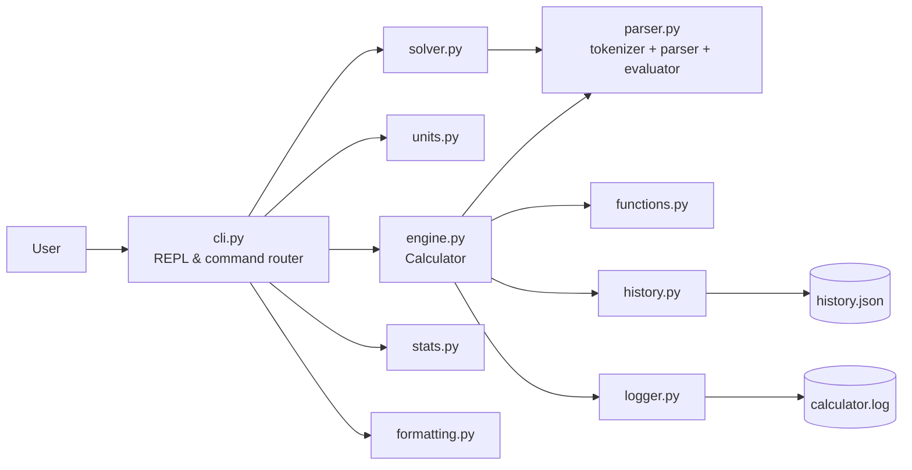
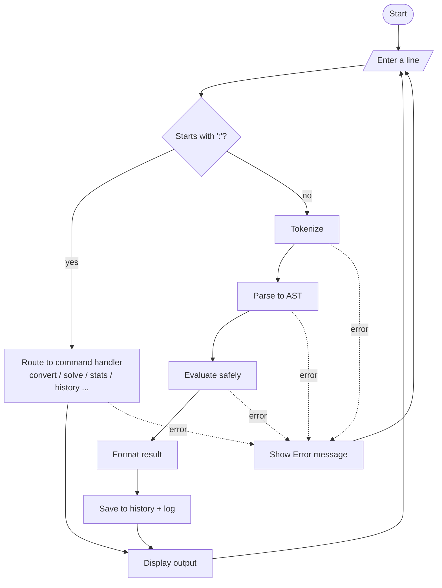
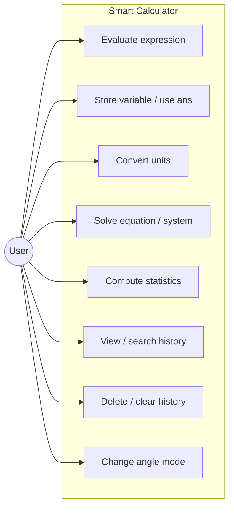
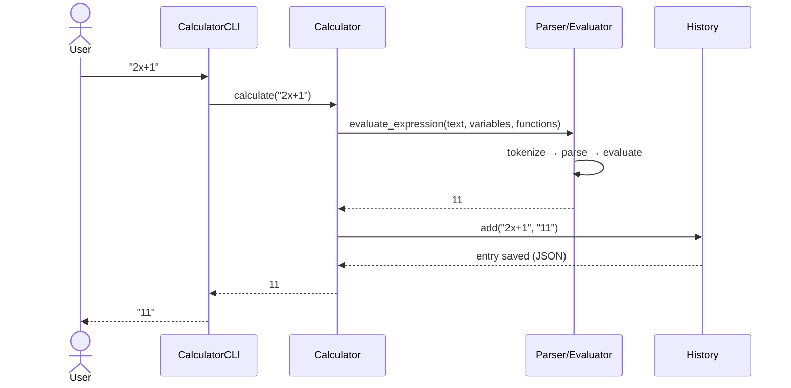
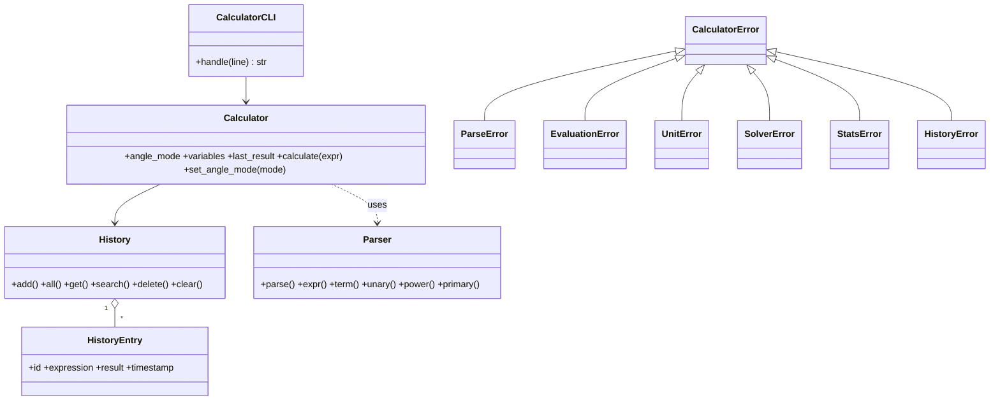
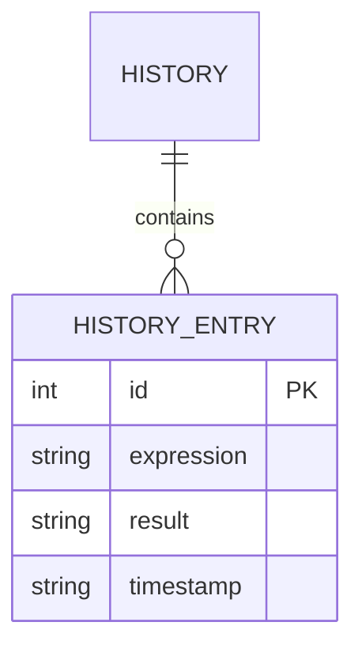

# Design Document – Smart Calculator

(Diagrams are written in Mermaid, which GitHub renders automatically. Export them as images for the PDF report, e.g. via https://mermaid.live.)

## 1. Functional requirements
| ID | Requirement |
|---|---|
| FR1 | Evaluate arithmetic expressions with precedence, parentheses, functions, constants |
| FR2 | Store variables (`x = 5`) and reuse the last result (`ans`); switch degree/radian mode |
| FR3 | Convert between units in 8 categories |
| FR4 | Solve linear/quadratic equations from text and n×n linear systems |
| FR5 | Compute descriptive statistics for a list of numbers |
| FR6 | Keep history: create, read/search, delete, clear; persist between sessions |
| FR7 | Interactive REPL and one-shot command-line mode |

**Input/Output:** input is one text line (expression or `:command`); output is a formatted result or an `Error: …` message.

## 2. Non-functional requirements
| Type | Requirement |
|---|---|
| Security | No `eval`/`exec`; whitelisted grammar; limits on length (500), exponent (10 000), factorial (1 000) |
| Reliability | Custom exceptions; REPL never crashes; history file written atomically; corrupt history file is ignored |
| Usability | Clear error messages with position info; `:help`; implicit multiplication (`2x`) |
| Performance | Any supported expression evaluates in well under 10 ms |
| Maintainability | 11 small modules, one responsibility each; type hints and docstrings; 38 unit tests; CI |
| Logging | Rotating log file records every calculation and failure |
| Resource efficiency | Standard library only; history capped at 500 entries |

## 3. System architecture

## 4. Workflow diagram

## 5. Use case diagram

## 6. Sequence diagram (evaluating `2x+1` after `x = 5`)

## 7. Class / component diagram

## 8. Storage design (ER)
History is stored as a JSON list.

## 9. Design decisions & rationale
- **Recursive-descent parser instead of `eval`** – safe by construction, gives good error messages, and demonstrates compiler concepts (tokenizer, grammar, AST).
- **Equation solver reuses the evaluator** – f(x)=lhs−rhs is sampled at three points to recover a,b,c, then verified at three more points; avoids writing a separate algebra parser.
- **Gaussian elimination with partial pivoting** – numerically stable, detects singular systems.
- **JSON history with atomic writes** – human readable, no database needed, safe against crashes.
- **Standard library only** – zero install friction for evaluators.
- **CLI `handle()` returns strings** – makes the interface fully unit-testable.
